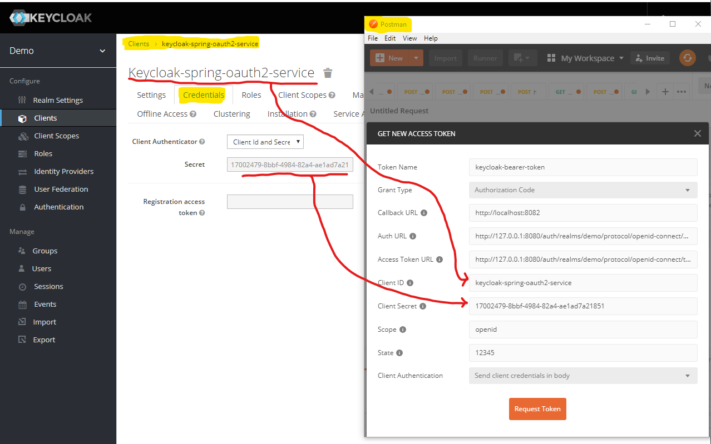

# Keycloak with Spring OAuth2


:warning: **Note! Keycloak is enabled by default.**

### Requirements
(More what I have used)
* Java 13 (I think java 8 will be ok)
* Maven 3.5+
* Spring Boot 2.2.4
* Keycloak 8.0.2
* Spring OAuth2

If Keycloack is upgraded to a newer version there is a big chance that you must update
the Keycloak Spring Boot Adapter as well. This could be a big problem when you have a whole bunch of microservices.

This [article by Arun B. Chandrasekaran](https://medium.com/@bcarunmail/securing-rest-api-using-keycloak-and-spring-oauth2-6ddf3a1efcc2)
solves this problem by using Spring OAuth2 which integrates with Keycloak at protocol level (less likely to change).

This project is an implementation of Aruns example.

 
## Security
The application has a layer of security by using Keycloak Identity Access Manager (IAM) for authentication and 
Authorization.

### Keycloak

Please download and start keycloak. 
How you do this is out of the scope. I assume Keycloak is running locally.
  
#### Web Admin interface
http://localhost:8080/auth/admin

#### Setup a new Realm
* Log in to Keyclock with the newly created admin user and password
* _Add realm_ `demo`. Click _create_. 
* Click _Clients_ and click _create_. Set `Client ID = keycloak-spring-oauth2-service`. Click _save_. 
* Inside the new client 
  * Set `Access Type = confidential`
  * Set `Service Accounts Enabled = ON`
  * Set `Authorization Enabled = ON`
  * Set `Valid Redirect URIs = http://localhost:8082/*`. 
  * Click _save_.
* Inside the new client, click _Roles_. Create role ```user```.
* Inside the new client, click _Mappers_. 
  * Click _Create_
  * Set `Name = username`
  * Set `Mapper Type = User Property`
  * Set `Property = username`
  * Set `Token Claim Name = user_name`
  * Set `Claim JSON Type = String`
  * Click _save_
* Click _Users_ and _Add user_. Pick a username of you choice.
  * Click tab _Credentials_ and give the user a password. Note the temporary password setting.
  * Click tab _Role Mappings_. In the dropdown box _Client Roles_ select _output-tracker-app_. Transfer `user` from Available Roles to Assigned Roles.


#### Configure Spring Boot 
* Open `application.properties`
* Change as needed!

```
rest.security.issuer-uri=http://localhost:8080/auth/realms/demo
security.oauth2.resource.id=keycloak-spring-oauth2-service
security.oauth2.resource.jwt.key-value=-----BEGIN PUBLIC KEY-----MIIBIjANBgkqhkiG9w0BAQEFAAOCAQ8AMIIBCgKCAQEAsmnNqZp9N9BPFcYuxsUNBOjPv0X/37tVx53SQXL70w+KDypN1xYFJlMrMJ1zaUcL3b7dret5/FlP54Uukj3HjYv3ihAHXbUotGppBdDb1J2pp7/IErZYlO+cdXXkNSXoobcF5BQB4lBQAXIksdr8jswP2sQdoMBCjoF1HqrBPhZ4dZUvaa735eZSXszM7jEKFRQ5nW3L7ag+jWkuhZAzxd7iC6MPI36l9rBaWfgVijT3GxitAqYB+EgGgK3xJcDOrbqxmj+TrgkRL4V1/3D9Y+V84QwmZ+V257ByurP3RQbIOPSQq/n1lYbQGY4+7YIyWVMcTXLdEQdQfiiJclTn0wIDAQAB-----END PUBLIC KEY-----

# If this micro-services that needs to call another
# secured micro-service
security.oauth2.client.client-id=keycloak-spring-oauth2-service
security.oauth2.client.client-secret=17002479-8bbf-4984-82a4-ae1ad7a21851
```
* The public key `security.oauth2.resource.jwt.key-value` is found here "Keycloak Admin > Realm Settings > Keys > RSA Public key" 
* The secret `security.oauth2.client.client-secret` is found here "Keycloak Admin > Clients > keycloak-spring-oauth2-service > Credentials > Secret" 
 
## FAQ

### How to enable and disable Keycloak?
rest.security.enabled=true

### What is protected by Keycloak?
All and everything which is not much 
* `/api/v1/employees/username`
* `/api/v1/employees/roles`

### How to start Keycloak?
If you downloaded and unzipped Keycloak go to keycloack-8.0.2/bin and run standalone.bat or standalone.sh.
It should now start on port 8080 by default.

### How to start the application?
* `> mvn clean install`
* `> mvn spring-boot:run`

Or start from within you favorite IDE

### How do I test the API security?
You can use Curl, Postman or write you own client and more. 
I am using [Postman](https://www.postman.com/downloads/).

#### Postman
* Select POST and provide API POST endpoint mentioned earlier in this documentation
* **Authorization:** 
** If `rest.security.enabled=false` you do not need to fill out anything for `Authorization`
** If `rest.security.enabled=true` please follow instructions for Keycloak below
* Click _SEND_. Watch for 200 Ok inside Postman

##### When `rest.security.enabled=true`
* Inside Postman click _Authorization_
* Select TYPE = OAuth 2.0
* Click _Get New Access Token_
* Fill out the fields as shown in the picture


* Auth URL: `http://127.0.0.1:8080/auth/realms/demo/protocol/openid-connect/auth`
* Access Token URL: `http://127.0.0.1:8080/auth/realms/demo/protocol/openid-connect/auth`
* Client Secret: `[Keycloak Admin > Realm Settings > Keys > pick any and paste here]`

## TODO
* Try migrate away from spring-security-oauth2-autoconfigure 2.0.1.RELEASE. 
See this [migration guide](https://github.com/spring-projects/spring-security/wiki/OAuth-2.0-Migration-Guide).
* Implement use of OAuth2RestTemplate for service to service communication  

